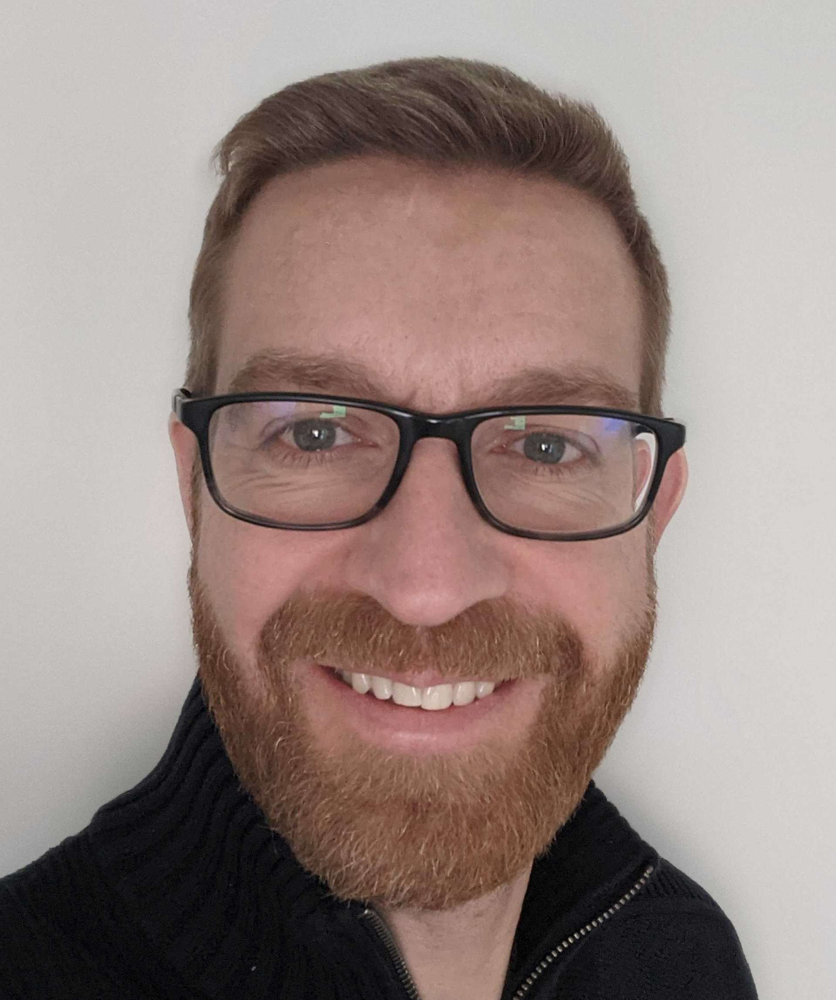

<!-- font: frutiger -->

# Stochastic Process Lectures

---

This is a repo for a couple of lectures on stationary stochastic processes that I have given at Stockholm University.

### Contents

* Intro to stationary stochastic processes
* Correlation properties
* Spectral properties
* Mean square convergence
* Spectral representation of stationary stochastic processes

---

### Course literature and Schedule

The lectures will be based on parts of the following books:

* Lindgren, G. Rootzén, H. and Sandsten, M. (2014). Stationary Stochastic Processes for Scientist and Engineers, CRC Press. (abbreviated LRS)
* Lindgren, G. (2014). Stationary Stochastic Processes, CRC Press. (abbreviated LAdv)
---

### Teacher

\
[Mattias Villani](https://mattiasvillani.com), Lecturer \
Professor, Natural Born Bayesian :stuck_out_tongue_winking_eye: \
Department of Statistics, Stockholm University \
Division of Statistics and Machine Learning, Linköping University

---

**Lecture 1 - Stationary Stochastic Processes**\
Reading: LRS Ch. X, Y |  LAdv Ch. X, Y | [Slides](https://github.com/mattiasvillani/StochasticProcesses/raw/master/Slides/SP_L1.pdf) \

**Lecture 2 - Spectral properties and representation**\
Reading: LRS Ch. X, Y |  LAdv Ch. X, Y | [Slides](https://github.com/mattiasvillani/StochasticProcesses/raw/master/Slides/SP_L2.pdf) \
